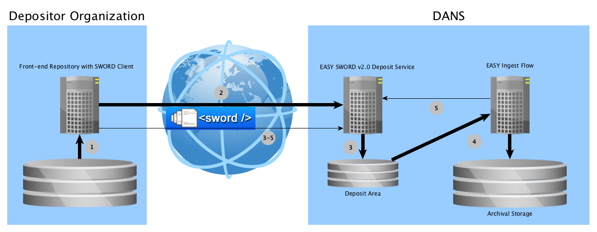

Depositing in EASY with SWORD v2.0
==================================

Overview
--------
Depositing in EASY via the SWORD v2.0 protocol is basically a two-phase process:

1. Submitting a deposit for ingest.
2. Tracking the state of the deposit as it goes through the ingest-flow, until it reaches ARCHIVED status.

The following diagram details this a bit further.

1. Client creates a deposit package.
2. Client sends deposit package to SWORD Service, getting back a URL to track the deposit's state.
3. SWORD Service unzips and validates deposit.
4. EASY Ingest Flow performs checks and transformations and creates a dataset in Archival Storage.
5. EASY Ingest Flow reports back success or failure to SWORD Service.

3-5. During this time the Client periodically checks the deposit state through the URL received in step 2. If the final state of `ARCHIVED` is
reached, the process is concluded successfully. Other outcomes may be `INVALID` (the package did not meet the requirements of the SWORD service) 
or `REJECTED` (the package did not meet the requirements of the EASY Ingest Flow).

### Example Code
The following specifications may be easier to follow if you have a look at the [SWORD v2.0 client examples].

[SWORD v2.0 client examples]: https://github.com/DANS-KNAW/easy-sword2-dans-examples

SWORD
-----
### About the SWORD v2.0 Protocol

From the [SWORD website]:

> SWORD is a lightweight protocol for depositing content from one location to another.
> It stands for Simple Web-service Offering Repository Deposit and is a profile of the 
> Atom Publishing Protocol (known as APP or ATOMPUB). 

The [specifications of SWORD v2.0] build on those of [Atom] and [AtomPub]. AtomPub in turn builds on
[HTTP]. It is, however, not necessary to have thorough familiarity with all of these specifications in order to build
a SWORD client for the DANS EASY SWORD v2.0 Service.   

[SWORD website]: http://swordapp.org/about/
[specifications of SWORD v2.0]: http://swordapp.github.io/SWORDv2-Profile/SWORDProfile.html 
[Atom]: https://tools.ietf.org/html/rfc4287
[AtomPub]: https://tools.ietf.org/html/rfc5023
[HTTP]: https://tools.ietf.org/html/rfc2616

### The EASY SWORD v2.0 Implementation

The DANS SWORD v2.0 service uses our own implementation of the protocol. It is developed as open source software on GitHub.
The [easy-sword2] project is intended as a generic component that may be used by other parties that need to host a deposit 
service. For the purpose of client development some parts of the `easy-sword2` documentation are required reading, especially
[the section about its external interface].

[easy-sword2]: https://github.com/DANS-KNAW/easy-sword2
[the section about its external interface]: https://github.com/DANS-KNAW/easy-sword2#sword-interface

EASY Ingest Flow
----------------
After your deposit has been successfully submitted, it enters the EASY Ingest Flow. For the package to be converted
into an archived dataset in EASY it must meet some additional requirements.  

### Additional Packaging Requirements

In addition to being a valid bag (see [BagIt]) the package sent to the deposit service must meet the following
criteria:

* There must be a payload manifest that uses the SHA-1 algorithm.
* The deposit must not contain computer viruses. If viruses are found, the deposit is rejected.
* There must be a directory called `metadata` directly under the bag's base directory.
* The `metadata` directory must contain exactly the following files:
    
    - `dataset.xml` 
    - `files.xml` 

[BagIt]: https://tools.ietf.org/html/draft-kunze-bagit#section-3

#### Structure and Semantics of `dataset.xml`
The `dataset.xml` describes the dataset as a whole. It must comply with the [DANS Dataset Metadata XML schema]. In addition:

* There may be at most one `dcterms:license` element. This determines an "additional license" for the dataset. The additional
  license must be accepted by users of the dataset, apart from the standard *General Conditions of Use for DANS*. This additional
  license may be specified in one of two ways:
  
    - If the `dcterms:license` element contains the attribute `xsi:type="dcterms:URI"` then the element text must be one of the
      following Open Source license URI's:
        * [http://creativecommons.org/publicdomain/zero/1.0/](http://creativecommons.org/publicdomain/zero/1.0/)
        * [http://creativecommons.org/licenses/by/4.0](http://creativecommons.org/licenses/by/4.0)
        * [http://opensource.org/licenses/MIT](http://opensource.org/licenses/MIT)
        * [http://www.apache.org/licenses/LICENSE-2.0](http://www.apache.org/licenses/LICENSE-2.0)
        * [http://opensource.org/licenses/BSD-3-Clause](http://opensource.org/licenses/BSD-3-Clause)
        * [http://opensource.org/licenses/BSD-2-Clause](http://opensource.org/licenses/BSD-2-Clause)
        * [http://www.gnu.org/licenses/gpl-3.0.en.html](http://www.gnu.org/licenses/gpl-3.0.en.html)
      
      Any other URI will cause the dataset to be rejected. Also, in this case the `dcterms:rightsHolder` element must be specified.
      Its element text will be filled in for the rights holder if required by the license.
    - If above attribute is not specified the element text itself is stored as the additional license.
* There must be exactly one `ddm:available` element with an ISO 8601 conformant date which specifies from what date on the 
  dataset will be available for dissemination. To make the dataset available on publishing, specify the current date or some 
  date in the past.
* If the agreement between the depositing organization and DANS specifies that the depositor provides a resolvable DOI identifier, 
  exactly one such identifier must be specified using a `dcterms:identifier` element with the attribute `xsi:type="id-type:DOI"`
  in which the prefix `id-type` is mapped to the namespace `http://easy.dans.knaw.nl/schemas/vocab/identifier-type/`. In this case
  EASY will not generate a DOI for the dataset, but instead use to provided DOI to show a link to the current access point for the
  data.

[geographic coordinates page]: ./GeographicCoordinates.html

[DANS Dataset Metadata XML schema]: https://easy.dans.knaw.nl/schemas/md/2016/ddm.xsd

#### Structure and Semantics of `files.xml`

`files.xml` describes the payload files of the deposited package. There is currently no XML schema for it. It must comply with the
following rules:

* The document element must be `files`.
* The document element must contain zero or more `file` elements, and may not contain other elements.
* Each `file` element must have a `filepath` attribute which contains the bag local path to the payload file
  described.
* There must be exactly one `file` element for each payload file.
* Each `file` element must contain at least one [DCTERMS] `format` element containing the MIME-type of the file described.
* Each `file` element may contain any number of other DCTERMS elements describing the file.
* If the `file` element contains a `dcterms:title` element the text of that element will be used as the file name in the EASY Web-UI presentation. 
  This feature allows depositors to use more cryptic actual names (such as UUIDs) for their actual file names. 

[DCTERMS]: http://www.dublincore.org/documents/dcmi-terms/

